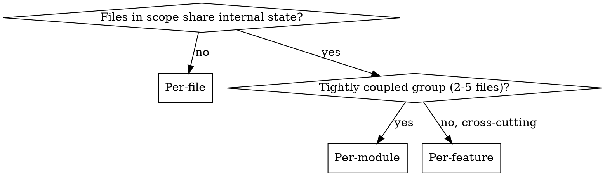

# Scoping Context for Subagents

## Overview

Subagent output quality depends on what context you **include AND exclude**. Over-including causes attention dilution (each token gets less focus). Under-including causes inconsistent results across agents. This skill sits between planning and execution -- after you know WHAT to do, before you dispatch agents to do it.

**REQUIRED:** Use with `superpowers:dispatching-parallel-agents` for execution.

## When to Use

- Before dispatching parallel subagents for multi-file/multi-module work
- When parallel agents will touch code that shares types, interfaces, or conventions
- When consistency across parallel outputs matters (refactoring, migration, pattern enforcement)

**Skip when:** Single-agent task, or units have zero shared concerns.

## The Process

### 1. Map Scope and Dependencies

List all files/modules involved. Draw the dependency graph. Identify which units are independent (parallelizable) vs coupled (must be sequential or same agent).

### 2. Extract the Context Core

The context core is the minimal shared knowledge **every** agent needs:

- Shared types, interfaces, contracts (public API surface only, not implementations)
- A reference example showing what "done" looks like for one unit
- Relevant CLAUDE.md rules
- Task-specific constraints and gotchas

**The context core must be concise.** Aim for ~200 lines as a starting point. If larger, try to compress first (summarize, extract only signatures, condense). If you can justify every line as essential shared knowledge, exceeding 200 is fine -- the point is to force the question, not impose a hard cap. An unbounded "migration spec" dilutes attention in every agent that receives it.

### 3. Determine Granularity

State your reasoning. "Per-service because each service's 3 files are tightly coupled but services are independent" is correct. "Per-service because there are 6 services" is not.

### 4. Scope Each Unit

For each work unit, define explicitly:

| Field                  | What to specify                                                                    |
| ---------------------- | ---------------------------------------------------------------------------------- |
| **READS**              | Context core + unit-specific files. List them by path.                             |
| **WRITES**             | Only files within this unit.                                                       |
| **EXCLUDES**           | Other units, unrelated code. Agents that CAN read everything WILL read everything. |
| **Attention estimate** | Core (~N lines) + unit (~M lines) = total. Flag if >2000 lines.                    |

### 5. Identify Ordering Constraints

- **Pre-work:** Must anything complete before parallel execution? (e.g., auditing shared contracts, generating the reference example)
- **Inter-unit dependencies:** Does any unit's output feed into another? If so, sequence them or merge into one unit.
- **Post-work:** What requires seeing all results together? (cross-unit review)

### 6. Define Consistency Checks

List **specific properties** to verify across all completed units:

- Import paths and aliases (exact strings)
- Naming conventions for key variables/types
- Configuration/initialization patterns
- Error handling patterns
- Interface compliance

**"Check for inconsistencies" is not a consistency check.** Name the exact things to compare.

## Quick Reference

| Step         | Key question                          | Output                                                |
| ------------ | ------------------------------------- | ----------------------------------------------------- |
| Map scope    | What's the dependency graph?          | Independent vs coupled units                          |
| Context core | What does every agent need?           | ~200 line shared reference                            |
| Granularity  | Per-file, per-module, or per-feature? | Unit boundaries with reasoning                        |
| Scope units  | What does THIS agent see?             | READS/WRITES/EXCLUDES per unit                        |
| Ordering     | What must happen first?               | Sequential pre-work, parallel work, sequential review |
| Consistency  | What EXACTLY to verify?               | Named property checklist                              |

## Common Mistakes

| Mistake                                | Why it fails                                      | Fix                                            |
| -------------------------------------- | ------------------------------------------------- | ---------------------------------------------- |
| "Each agent gets the spec" (unbounded) | Spec becomes attention-diluting blob              | The spec IS the context core. Size-bound it.   |
| "Flag any inconsistencies"             | Reviewer doesn't know what to look for            | List specific properties by name               |
| Scoping writes but not reads           | Agents read everything available, diluting focus  | Explicit EXCLUDES per unit                     |
| No attention estimate                  | 5000-line context → degraded output quality       | Estimate lines per agent, split if >2000       |
| Chose granularity without reasoning    | Wrong split causes incoherent results             | State WHY: coupling, independence, coherence   |
| Context core includes implementations  | Agents don't need internals, just the API surface | Signatures and types only, not function bodies |
