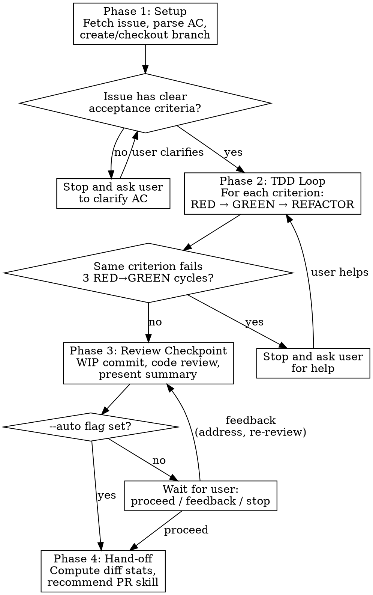

# TDD-PR

Implement a GitHub issue end-to-end: fetch it, TDD each acceptance criterion, review, and hand off to a PR workflow.

## Invocation

```
/tdd-pr <gh_issue> [branch] [--auto]
```

- `gh_issue` -- GitHub issue number or URL (required)
- `branch` -- branch name (optional; auto-generated from issue title)
- `--auto` -- skip review pause; auto-invoke recommended hand-off skill

## Prerequisites

Before starting, verify ALL of these. Stop with a clear error if any fails:

1. Inside a git repository
2. `gh auth status` passes
3. No uncommitted changes to tracked files (`git diff --quiet && git diff --cached --quiet`)

## Workflow



## Phase 1: Setup

1. Fetch issue: `gh issue view <gh_issue> --json title,body,labels`
2. Parse the body for acceptance criteria (numbered lists, checkboxes, "AC:" sections)
3. If no clear acceptance criteria found: **stop**. Show what you found and ask the user to clarify before proceeding.
4. Branch handling:
   - `branch` arg provided → create or checkout that branch
   - Omitted → generate from issue (e.g., `issue-42-add-widget-validation`)
   - Branch already has commits → **continue from current state, do not reset**

**Output:** Branch checked out, acceptance criteria listed.

## Phase 2: TDD Loop

**REQUIRED:** Invoke the `superpowers:test-driven-development` skill for each acceptance criterion.

For each criterion in order:

1. **RED** -- write a failing test for the desired behavior
2. **Verify RED** -- run tests, confirm new test fails for the right reason
3. **GREEN** -- write minimal code to pass
4. **Verify GREEN** -- run full suite, confirm all tests pass with pristine output
5. **REFACTOR** -- clean up while staying green

**Failure mode:** If the same criterion fails 3 RED-to-GREEN cycles (test written but implementation can't pass), **stop and ask the user for help**. Summarize what was attempted and what's blocking.

**Output:** All criteria covered by passing tests.

## Phase 3: Review Checkpoint

**Skipped entirely if `--auto` is set.** Jump straight to Phase 4.

1. Create a WIP commit with all changes
2. Run the `superpowers:code-reviewer` agent on the diff (branch vs base)
3. Present summary:
   - What was implemented (mapped to acceptance criteria)
   - Test results (pass count, coverage if available)
   - Code review findings
4. Wait for user input:
   - **"proceed"** → move to Phase 4
   - **Specific feedback** → address it, re-run review, re-present
   - **"stop"** → leave work on branch, user takes over manually

**Output:** Reviewed, committed code with user approval to proceed.

## Phase 4: Hand-off

1. Compute diff stats: `git diff --stat main...HEAD`, count files changed and lines added/removed
2. Apply heuristic:
   - **3 or fewer files** AND **100 or fewer lines changed** → recommend `/commit-push-pr`
   - **Otherwise** → recommend `/git-workflow`
3. If `--auto`: invoke recommended skill immediately
4. If not `--auto`: present recommendation with reasoning, let user confirm or override
5. Invoke the chosen skill

**Output:** Hand-off to PR workflow.

## What This Skill Does NOT Do

- Write PR descriptions (hand-off skill handles that)
- Run breaking change analysis (git-workflow handles that)
- Manage CI/CD checks (git-workflow handles that)
- Make architectural decisions (implements what the issue specifies)
