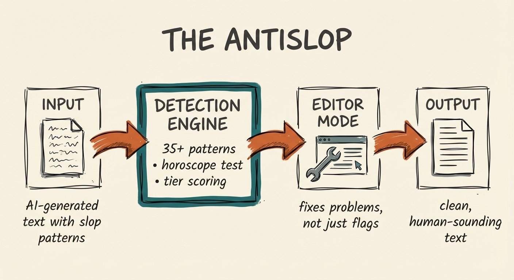

# The AntiSlop



A Claude Code skill that detects and **fixes** AI-generated writing patterns. More comprehensive than detection alone — it actually rewrites the problems.

## Why This Exists

AI-generated text has tells. Wikipedia's [Signs of AI Writing](https://en.wikipedia.org/wiki/Wikipedia:Signs_of_AI_writing) documents 24 patterns. But detection alone isn't enough. You need a tool that:

1. **Detects comprehensively** — 35+ patterns across content, language, style, and structure
2. **Scores severity** — Not all patterns are equally bad (tiered system)
3. **Actually fixes problems** — Editor mode rewrites, not just flags
4. **Catches structural tells** — Staccato fragments, manufactured personality, uniformity

## Installation

```bash
mkdir -p ~/.claude/skills
git clone https://github.com/aplaceforallmystuff/the-antislop.git ~/.claude/skills/the-antislop
```

## Usage

In Claude Code, Claude Desktop, or any Claude interface with skill support:

```
/antislop

[paste your text here]
```

Or ask Claude directly:

```
Run antislop on this draft: [your text]
```

## The Horoscope Test

> "Could anyone have written this, for anyone?"

If yes, it's slop. Like a horoscope — technically applicable to everyone, resonant with no one.

## Detection Categories

### Tier 1: Remove Immediately
- delve, game-changer, revolutionary, leverage, unlock potential
- "it's worth noting," "in today's digital landscape"
- moreover, furthermore, cutting-edge

### Tier 2: Suspicious When Repeated
- here's the thing, at the end of the day, the bottom line
- paired adjectives ("comprehensive and thorough")
- template openings ("In this post, we'll cover...")

### Tier 3: Watch for Clusters
- transition words (however, firstly, moving forward)
- corporate buzzwords (robust, seamless, scalable)

### Structural Patterns (Often Missed)
- **Staccato fragments:** "Short. Punchy. Exhausting."
- **Sentence uniformity:** Every sentence 10-15 words
- **Comparator sentences:** "This isn't X. It's Y."
- **Manufactured personality:** Fake developer snark
- **Self-promotional framing:** Author's achievements as headline

## Scoring System

| Pattern Type | Points |
|--------------|--------|
| Tier 1 phrase | +3 |
| Tier 2 (repeated) | +2 |
| Tier 3 cluster | +2 |
| Failed horoscope test | +5 |
| Staccato fragment spam | +4 |
| Manufactured personality | +4 |

- **0-5:** Low risk
- **6-12:** Medium risk (significant editing needed)
- **13+:** High risk (likely unedited AI)

## Editor Mode

Unlike detection-only tools, The AntiSlop **fixes problems** by default:

1. Removes Tier 1 phrases
2. Deduplicates Tier 2 phrases
3. Combines staccato fragments into flowing prose
4. Replaces comparator sentences with direct statements
5. Varies sentence lengths

Request "audit only" if you just want detection without edits.

## Example

**Before:**
> Let's delve into how AI is revolutionizing the landscape. It's worth noting that these game-changing tools are unlocking potential at scale. The speed is impressive. The quality is enhanced. The adoption is growing.

**After:**
> Here's how teams are using AI coding tools. In a 2024 Google study, developers completed simple functions 55% faster, but showed no improvement on debugging. The tools handle boilerplate well — config files, test scaffolding, repetitive refactors — but can't tell when they're wrong.

## Further Reading

For more on AI writing patterns and maintaining your authentic voice, see the [AI Writing Field Guide](https://go.signalovernoise.at/products/the-ai-writing-field-guide).

## Credits

- Pattern research from [Wikipedia: Signs of AI Writing](https://en.wikipedia.org/wiki/Wikipedia:Signs_of_AI_writing)
- [WikiProject AI Cleanup](https://en.wikipedia.org/wiki/Wikipedia:WikiProject_AI_Cleanup)
- Finnish study on "delve" usage (56,878 essays)
- Georgia Tech analysis (168.3M articles)

## License

MIT

## Author

Jim Christian ([@jimchristian](https://jimchristian.net))
